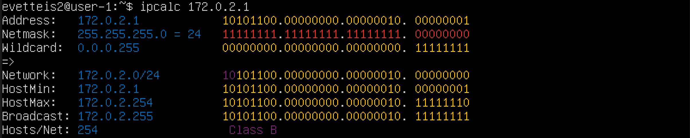
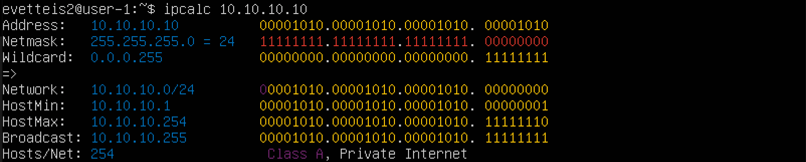
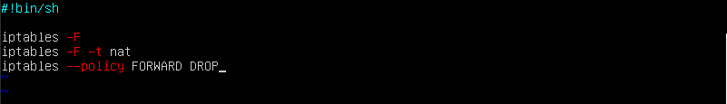

# Сети в Linux

## Part 1. Инструмент **ipcalc**

#### 1.1. Сети и маски
Установила ipcalc 
<br>*Установка ipcalc*<br>
Определила и записала в отчёт:
1) Адрес сети *192.167.38.54/13*<br>
192.167.38.54
<br>*Адрес сети*<br>
2) Перевод маски *255.255.255.0* в префиксную и двоичную запись, */15* в обычную и двоичную, *11111111.11111111.11111111.11110000* в обычную и префиксную
- **255.255.255.0**:
  + **/24**
  + **11111111.11111111.11111111.00000000**
<br>
- **/15**:
  + **255.254.0.0**
  + **11111111.11111110.00000000.00000000**
<br>
- **11111111.11111111.11111111.11110000**:<br>
  + **перевела в десятичный вид и выполнила команду `ipcalc`**
  + **255.255.255.240**
  + **/24**
<br>
3) Минимальный и максимальный хост в сети 12.167.38.4:
- **/8**:
    + **12.0.0.1** | **12.255.255.254**
    <br>
- **11111111.11111111.00000000.00000000**:
    + **12.167.0.1** | **12.167.255.254**
    <br>
- **255.255.254.0**:
    + **12.167.38.1** | **12.167.39.254**
    <br>
- **/4**:
    + **0.0.0.1** | **15.255.255.254**
    <br>

#### 1.2. localhost
##### Определила, можно ли обратиться к приложению, работающему на localhost, со следующими IP: *194.34.23.100*, *127.0.0.2*, *127.1.0.1*, *128.0.0.1*

- **По адресам 194.34.23.100/16 и 128.0.0.1/8 обратиться к приложению не получится, потому что у них нет петли.**
- **У 127.0.0.2/24 и 127.1.0.1/8 есть loopback, так что к ним обратиться можно.**

#### 1.3. Диапазоны и сегменты сетей
##### Определила и записала в отчёт:
##### 1) какие из перечисленных IP можно использовать в качестве публичного, а какие только в качестве частных: *10.0.0.45*, *134.43.0.2*, *192.168.4.2*, *172.20.250.4*, *172.0.2.1*, *192.172.0.1*, *172.68.0.2*, *172.16.255.255*, *10.10.10.10*, *192.169.168.1*
- **10.0.0.45** - Приватный
<br>
- **134.43.0.2** - Публичный
<br>
- **192.168.4.2** - Приватный
<br>
- **172.20.250.4** - Приватный
<br>
- **172.0.2.1** - Публичный
<br>
- **192.172.0.1** - Публичный
<br>
- **172.68.0.2** - Публичный
<br>
- **172.16.255.255** - Приватный
<br>
- **10.10.10.10** - Приватный
<br>
- **192.169.168.1** - Публичный
<br>

##### 2) какие из перечисленных IP адресов шлюза возможны у сети *10.10.0.0/18*: *10.0.0.1*, *10.10.0.2*, *10.10.10.10*, *10.10.100.1*, *10.10.1.255*
  + **10.10.0.2**
  + **10.10.10.10**
  + **10.10.1.255**

## Part 2. Статическая маршрутизация между двумя машинами

##### С помощью команды `ip a` посмотреть существующие сетевые интерфейсы
 + **ws1 и ws2**
 <br>
##### Описала сетевой интерфейс, соответствующий внутренней сети, на обеих машинах и задать следующие адреса и маски: ws1 - *192.168.100.10*, маска */16*, ws2 - *172.24.116.8*, маска */12*, выполнив команду `sudo vim /etc/netplan/*.yaml`
 + **ws1 и ws2**
 <br>
##### Выполнила команду `netplan apply` для перезапуска сервиса сети
 + **ws1 и ws2**
 <br>

#### 2.1. Добавление статического маршрута вручную
##### Добавила статический маршрут от одной машины до другой и обратно при помощи команды вида `ip r add` на ws1 и ws2
 <br>
 <br>

#### 2.2. Добавление статического маршрута с сохранением
##### Добавила статический маршрут от одной машины до другой с помощью файла *etc/netplan/00-installer-config.yaml*
 <br>

## Part 3. Утилита **iperf3**

#### 3.1. Скорость соединения
 + Перевести и записать в отчёт: 8 Mbps в MB/s, 100 MB/s в Kbps, 1 Gbps в Mbps  </br>
  8 Mbps is 1 MB/s, </br>
  100 MB/s is 800000 Kbps, </br>
  1 Gbps is 1000 Mbps </br>

#### 3.2. Утилита **iperf3**
##### Измерила скорость соединения между ws1 и ws2
##### ws1 - `iperf3 -s` и ws2 - `iperf3 -c 192.168.100.10 -p 5201`
 <br>

## Part 4. Сетевой экран

#### 4.1. Утилита **iptables**
##### установила iptables командой `sudo apt-get install iptables`
##### Создала файл */etc/firewall.sh*, имитирующий фаерволл, на ws1 и ws2:
 <br>
##### Запустила файлы на обеих машинах командами `chmod +x /etc/firewall.sh` и `/etc/firewall.sh`
<br>
```
Разница между стратегиями в том, что они выполняться сверху-вниз, то есть если правило запрета находиться выше - оно срабатывает, а правило разрешения находящиеся ниже - нет.
```

#### 4.2. Утилита **nmap**
##### Командой **ping** нашла машину, которая не "пингуется"
<br>
##### после чего утилитой **nmap** показала, что хост машины запущен
<br>

## Part 5. Статическая маршрутизация сети

##### Подняла пять виртуальных машин (3 рабочие станции (ws11, ws21, ws22) и 2 роутера (r1, r2))

#### 5.1. Настройка адресов машин
##### Настроила конфигурации машин в *etc/netplan/00-installer-config.yaml* согласно сети на рисунке из README.md.
##### Перезапустила сервис сети. Командой `ip -4 a` проверила, что адрес машины задан верно.
<br>
<br>
<br>
<br>
<br>
<br>
<br>
<br>
<br>
<br>
##### Также пропинговала ws22 с ws21. Аналогично пропинговала r1 с ws11.
<br>
<br>
<br>
<br>

#### 5.2. Включение переадресации IP-адресов.
##### Для включения переадресации IP, выполнила команду на роутерах:
`sysctl -w net.ipv4.ip_forward=1`
<br>
*При таком подходе переадресация не будет работать после перезагрузки системы.*
##### Открыла файл */etc/sysctl.conf* и добавила в него следующую строку:
`net.ipv4.ip_forward = 1`
<br>
*При использовании этого подхода, IP-переадресация включена на постоянной основе.*

#### 5.3. Установка маршрута по-умолчанию
Пример вывода команды `ip r` после добавления шлюза:
```
default via 10.10.0.1 dev eth0
10.10.0.0/18 dev eth0 proto kernel scope link src 10.10.0.2
```
##### Настроила маршрут по-умолчанию (шлюз) для рабочих станций. Для этого добавила gateway4 \[ip роутера\] в файле конфигураций
<br>
<br>
<br>
##### Вызвала `ip r` и показала, что добавился маршрут в таблицу маршрутизации
<br>
<br>
<br>
##### Пропинговала с ws11 роутер r2 и показала на r2, что пинг доходит. Для этого использовала команду:
`tcpdump -tn -i eth1`
<br>

#### 5.4. Добавление статических маршрутов
##### Добавила в роутеры r1 и r2 статические маршруты в файле конфигураций.
<br>
##### Вызвала `ip r` и показала таблицы с маршрутами на обоих роутерах.
<br>
##### Запустила команды на ws11:
`ip r list 10.10.0.0/[маска сети]` и `ip r list 0.0.0.0/0`
<br>
``` 
Для адреса 10.10.0.0/18 был выбран маршрут, отличный от 0.0.0.0/0, потому что он является адресом сети и доступен без шлюза. 
Маршрут по умолчанию — это конфигурация протокола IP, которая устанавливает правило пересылки для пакетов, когда в таблице маршрутизации или других механизмах маршрутизации нет конкретного адреса узла следующего перехода. Маршрутизация осуществляется по принципу наибольшего совпадения маски. Маршрут по умолчанию в IPv4 обозначается как нулевой адрес , 0.0.0.0/0 в нотации CIDR. Маска подсети указывается как / 0 , что фактически указывает все сети и является кратчайшим возможным совпадением. Поиск маршрута, который не соответствует ни одному другому правилу, возвращается к этому маршруту.
```

#### 5.5. Построение списка маршрутизаторов
Пример вывода утилиты **traceroute** после добавления шлюза:
```
1 10.10.0.1 0 ms 1 ms 0 ms
2 10.100.0.12 1 ms 0 ms 1 ms
3 10.20.0.10 12 ms 1 ms 3 ms
```
##### Запустила на r1 команду дампа:
`tcpdump -tnv -i eth0`
##### При помощи утилиты **traceroute** построила список маршрутизаторов на пути от ws11 до ws21
<br>
<br>
```
Принцип работы построения пути при помощи **traceroute**:
Команда traceroute linux использует UDP пакеты. Она отправляет пакет с TTL=1 и смотрит адрес ответившего узла, дальше TTL=2, TTL=3 и так пока не достигнет цели. Каждый раз отправляется по три пакета и для каждого из них измеряется время прохождения. Пакет отправляется на случайный порт, который, скорее всего, не занят. Когда утилита traceroute получает сообщение от целевого узла о том, что порт недоступен трассировка считается завершенной.
Мы нашли нужный узел с первого раза, так как на роутере (r1 - он же шлюз по умолчанию) прописан статический маршрут в нужную сеть.
```

#### 5.6. Использование протокола **ICMP** при маршрутизации
##### Запустила на r1 перехват сетевого трафика, проходящего через eth0 с помощью команды:
`tcpdump -n -i eth0 icmp`
##### Пропинговала с ws11 несуществующий IP (например, *10.30.0.111*) с помощью команды:
`ping -c 1 10.30.0.111`
<br>

## Part 6. Динамическая настройка IP с помощью **DHCP**

*В данном задании используются виртуальные машины из Части 5*

##### Для r2 настроила в файле */etc/dhcp/dhcpd.conf* конфигурацию службы **DHCP**:
<br>
##### 2) в файле *resolv.conf* прописать `nameserver 8.8.8.8.`
<br>
<br>
##### Перезагрузила службу **DHCP** командой `systemctl restart isc-dhcp-server`. 
<br>
##### Машину ws21 перезагрузила при помощи `reboot` и через `ip a` показала, что она получила адрес. Также пропинговала ws22 с ws21.
<br>
<br>
<br>
##### Указала MAC адрес у ws11, для этого в *etc/netplan/00-installer-config.yaml* добавила строки: `macaddress: 10:10:10:10:10:BA`, `dhcp4: true`
<br>
##### Для r1 настроила аналогично r2, но сделала выдачу адресов с жесткой привязкой к MAC-адресу (ws11).
<br>
<br>
<br>
##### Запросить с ws21 обновление ip адреса
<br>
`sudo dhclint -r enp0X` удалить IP

`sudo dhclint  enp0X` назначить IP

`*X` - номер интерфеса согласно netplan

## Part 7. **NAT**

##### В файле */etc/apache2/ports.conf* на ws22 и r2 изменила строку `Listen 80` на `Listen 0.0.0.0:80`, то есть сделала сервер Apache2 общедоступным
<br>
##### Запустила веб-сервер Apache командой `service apache2 start` на ws22 и r1
<br>
<br>
##### Добавила в фаервол, созданный по аналогии с фаерволом из Части 4, на r2 следующие правила:
##### 1) Удаление правил в таблице filter - `iptables -F`
##### 2) Удаление правил в таблице "NAT" - `iptables -F -t nat`
##### 3) Отбрасывать все маршрутизируемые пакеты - `iptables --policy FORWARD DROP`
<br>
##### Запустила файл также, как в Части 4
<br>
##### Проверила соединение между ws22 и r1 командой `ping`
*При запуске файла с этими правилами, ws22 не должна "пинговаться" с r1*
<br>
##### Добавила в файл ещё одно правило:
##### 4) Разрешить маршрутизацию всех пакетов протокола **ICMP**
##### Запустила файл также, как в Части 4
<br>
##### Проверить соединение между ws22 и r1 командой `ping`
*При запуске файла с этими правилами, ws22 должна "пинговаться" с r1*
<br>
##### Добавила в файл ещё два правила:
##### 5) Включить **SNAT**, а именно маскирование всех локальных ip из локальной сети, находящейся за r2 (по обозначениям из Части 5 - сеть 10.20.0.0)
##### 6) Включить **DNAT** на 8080 порт машины r2 и добавить к веб-серверу Apache, запущенному на ws22, доступ извне сети
<br>
<br>
`sudo systemctl restart apache2`<br>
##### Запустила файл также, как в Части 4
<br>
*Перед тестированием рекомендуется отключить сетевой интерфейс **NAT** (его наличие можно проверить командой `ip a`) в VirtualBox, если он включен*
##### Проверила соединение по TCP для **SNAT**, для этого с ws22 подключилась к серверу Apache на r1 командой:
`telnet [адрес] [порт]`<br>
<br>
##### Проверила соединение по TCP для **DNAT**, для этого с r1 подключилась к серверу Apache на ws22 командой `telnet` (обратилась по адресу r2 и порту 8080)
<br>

## Part 8. Дополнительно. Знакомство с **SSH Tunnels**

##### Запустила веб-сервер **Apache** на ws22 только на localhost (то есть не изменять файл */etc/apache2/ports.conf* или, если был изменен ранее, вернуть строку `Listen 80`)
<br>
<br>
##### Воспользоваться *Local TCP forwarding* с ws21 до ws22, чтобы получить доступ к веб-серверу на ws22 с ws21
##### Воспользоваться *Remote TCP forwarding* c ws11 до ws22, чтобы получить доступ к веб-серверу на ws22 с ws11
##### Для проверки, сработало ли подключение в обоих предыдущих пунктах выполнила команду:
`telnet 127.0.0.1 [локальный порт]`<br>
<br>
